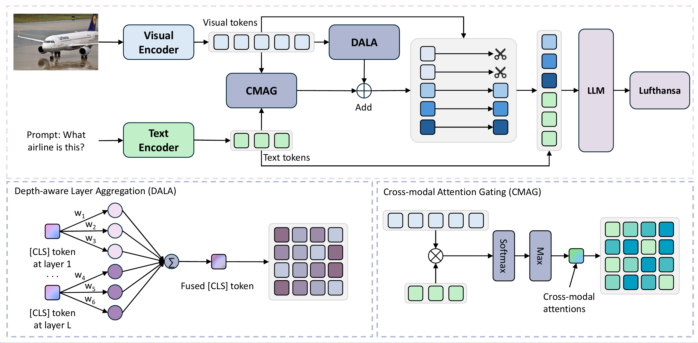

# ⚡️ DATP: Training-free Depth-awareness Token Pruning for Vision Language Model
*A simple and effective visual token pruning method that requires no training, which more accurately assesses the importance of visual tokens by associating [CLS] attention with image-text scores, thereby enabling faster VLM inference.*
## 📰 News

## 👁️ Overview
To address the significant computational challenges in Vision-Language Models (VLMs) arising from a high volume of visual tokens , this paper introduces DATP (Depth-awareness Token Pruning), a novel, training-free, and plug-and-play module designed to efficiently prune redundant visual tokens. The core mechanism first employs a Depth-aware Layer Aggregation (DALA) strategy, which leverages attention scores from the [CLS] token across the visual encoder's multiple layers to identify intrinsically critical visual information. Concurrently, a Cross-modal Attention Gating (CMAG) mechanism calculates the relevance between visual and textual tokens to highlight regions pertinent to the specific query. These cross-layer and cross-modal weights are then proportionally combined to make a final, accurate token selection. This approach proves highly effective; experiments on the LLaVA-v1.5-7B model show that DATP can prune 89% of visual tokens, reduce inference time by 29%, and retain 94.4% of the original performance. Consequently, DATP stands as a simple yet powerful method that surpasses existing techniques in both efficiency and performance across various benchmarks, even at extremely high pruning rates.


## ⚙️ Setup

### 🏝️ Environment

1. Clone this repository.
```bash
git clone https://github.com/lqxass/DATP.git
cd DATP
```

2. Install necessary packages.
```bash
conda create -n datp python=3.11 -y
conda activate datp
pip install -e .
```

3. (Optional) Install FlashAttention for further inference acceleration.
```bash
pip install flash-attn --no-build-isolation
```
### 📦️ Model

Download corresponding [LLaVA](https://github.com/haotian-liu/LLaVA/blob/main/docs/MODEL_ZOO.md) checkpoints from [Hugging Face](https://huggingface.co/liuhaotian) 🤗:

| Version | LLM | Checkpoint |
|----------|:----------:|:-----------:|
| LLaVA-1.5 | Vicuna-7B | [liuhaotian/llava-v1.5-7b](https://huggingface.co/liuhaotian/llava-v1.5-7b) |
| LLaVA-1.5 | Vicuna-13B | [liuhaotian/llava-v1.5-13b](https://huggingface.co/liuhaotian/llava-v1.5-13b) |

### 📊 Data

Download each dataset according to [EVAL.md](EVAL.md).

## 📋️ Evaluation

We provide the evaluation scripts for each benchmark, you only need to set the remaining visual token number as the bash argument. For example, if you want to evaluate DATP with remaining 192 visual tokens on the TextVQA benchmark, you can run the script `./scripts/evaluate_vqav2.sh` with argument `192`, you can run the following command:
```bash
CUDA_VISIBLE_DEVICES=0 bash scripts/v1_5/eval/textvqa.sh 192
```

The detailed guidance for evaluation commands and online submission of each benchmark can be found in [EVAL.md](EVAL.md).


## 🎟️ License

This project is released under the [Apache 2.0 license](LICENSE).

## 🎉 Acknowledgement

We appreciate the open-source efforts of [LLaVA](https://github.com/haotian-liu/LLaVA).